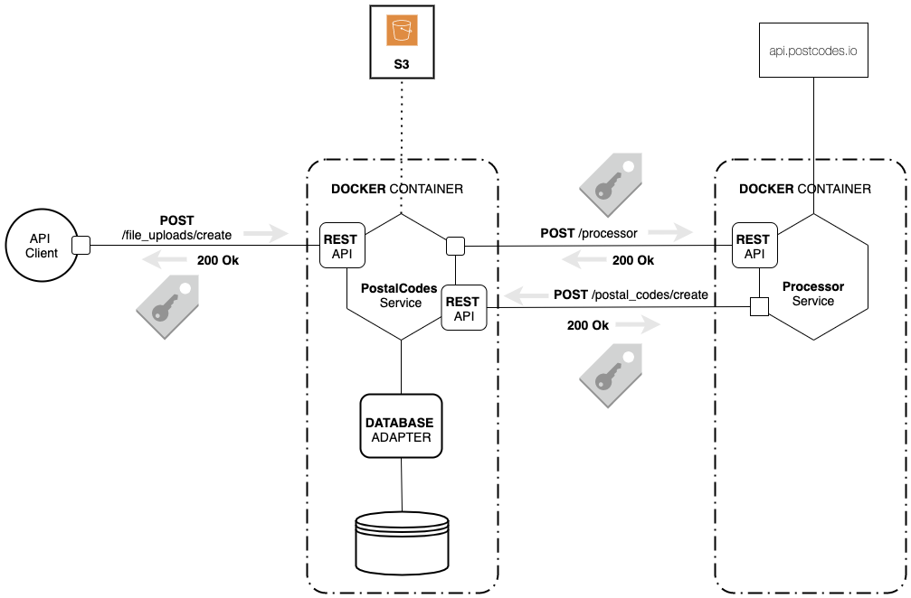
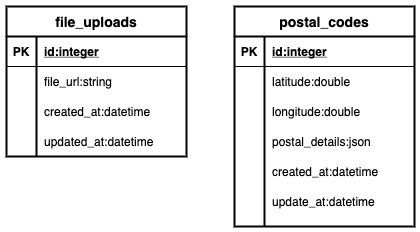
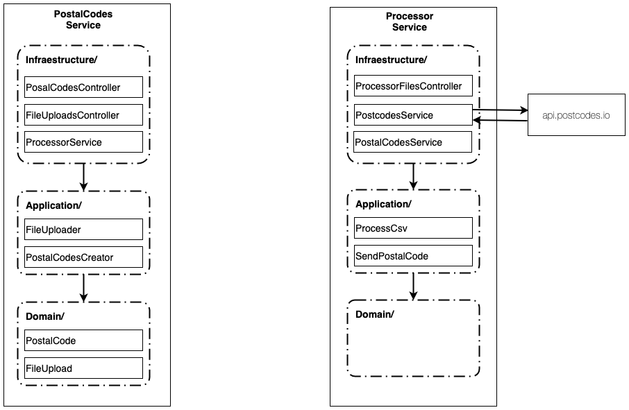

# Mi Aguila Test 


[Show Description Test](https://docs.google.com/document/d/1z5yN8-1yvjbjWoLErAR2rbJ_1c8veaWRV5Z60_ehig0/edit)


### * Run project using docker-compose
### Steps for installation

1. Please download docker-compose for your OS (Linux or Mac).
2. You can use this repository to be cloned or you can go to each project repository separately
   * [Postalcodes Project Repository](https://github.com/jpcontreras/postalcodes)
   * [Processor Project Repository](https://github.com/jpcontreras/processor)
3. Run docker-compose first to postalcodes project and after processor project:
    ```
    $ docker-compose up --build
    ```
---
## Postalcodes Microservice

### -- API docs
Go to <a href="http://127.0.0.1:8000/docs" class="external-link" target="_blank"> http://127.0.0.1:8000/docs </a>

### -- DB Access
Go to check database: <a href="http://0.0.0.0:8080/" class="external-link" target="_blank"> http://0.0.0.0:8080 </a>

## Processor Microservice
 
### -- API docs
Go to <a href="http://127.0.0.1:3000/docs" class="external-link" target="_blank"> http://127.0.0.1:3000/docs </a>

---

## Documentation Base

### Architecture


### Data Model


### Code Organization by layers (Hexagonal Architecture)


### * Git Flow Used
```
git checkout main
git pull origin main -r
git checkout -b [feature fixbug]/some_name
git pull origin [feature fixbug]/some_name
```
---

## *Pending criteria (Missing)*

1. Unit Tests
2. Performance in response and communication between microservices
3. Access security of microservices (they are publics)


## *Recommendations*

* use the endpoint to upload the file of processor microservice for faster response
* Use a file with a maximum of 2000 rows to get a faster response (the original file takes a long time)
* To see the full git flow please review the project repositories separately:
[Postalcodes Project Repository](https://github.com/jpcontreras/postalcodes) , 
[Processor Project Repository](https://github.com/jpcontreras/processor)


